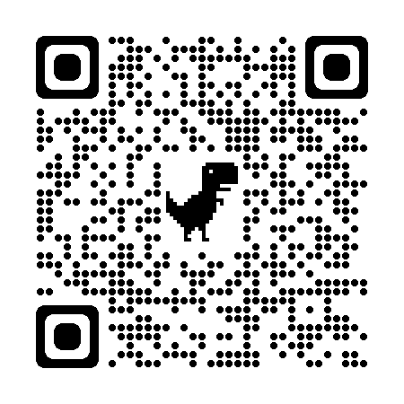

# Scavenger Hunt
This app is used to make a scavenger hunt game using QR codes to direct players to the next location.  Scanning a game QR code will cause the arrow in the app to point to the next location.

The app has a built-in QR code scanner so that participants don't have to leave the app to scan the found "clue", which points to the next location.

<https://jamesmikesell.github.io/scavenger-hunt/?lat=40.441839&lon=-80.012786>

OR

